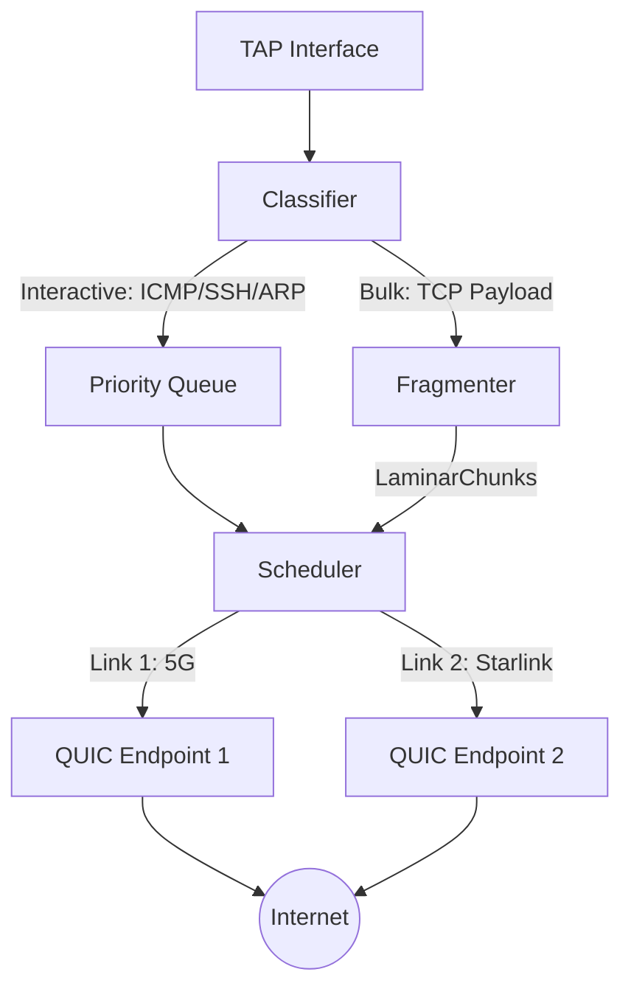

# Laminar: High-Performance L2 Mesh

<div align="center">


**A userspace L2 mesh network built on top of multi-path QUIC Datagrams.**

</div>

---

## 📖 Introduction

**Laminar** is a next-generation overlay network designed to bond heterogeneous physical links (WiFi, LTE, Ethernet, Starlink) into a single, resilient, high-bandwidth Ethernet segment. Unlike traditional VPNs that route IP packets over a single tunnel, Laminar operates at **Layer 2 (Ethernet)**, creating a virtual switch that spans across the internet.

It leverages **QUIC Datagrams** to provide a strictly unreliable transport layer, preventing the dreaded "TCP-over-TCP" meltdown. By handling fragmentation and reassembly at the application layer, Laminar supports jumbo frames and transparently bridges local LANs over the mesh.

## ✨ Key Features

- **🌊 Multi-Path Bonding**: Aggregate bandwidth from multiple interfaces (e.g., 5G + Fiber).
- **🕸️ L2 Learning Bridge**: Automatically learns MAC addresses to implement efficient Unicast switching, minimizing mesh flooding.
- **⚡ Traffic Sieve**: Intelligent packet classification that routes interactive traffic (VoIP, SSH) via the lowest latency link and bulk traffic via the highest bandwidth pipes.
- **🛡️ Custom Fragmentation**: Handles MTUs larger than the underlying path (e.g., 9000-byte jumbo frames) with a TTL-based garbage collector to prevent memory leaks.
- **🚀 Parallel Dialing**: Connects to all multi-path endpoints in parallel for near-instant initialization.
- **🔒 Strong Security**: Mutual TLS 1.3 with mandatory Public Key Pinning (Strong PFS) for all mesh connections.
- **📊 Observability**: Built-in interactive **TUI** and local **REST API** with real-time RTT/CWND monitoring.

## 🏗️ Architecture

### Data Plane: The Sieve & Water-Filling
Laminar implements a sophisticated scheduling algorithm:

1.  **Ingress**: Frames enter via the TAP interface.
2.  **Classification**:
    *   **Interactive**: ARP, ICMP, DNS, TCP SYN/ACK.
    *   **Bulk**: Payload-heavy TCP/UDP packets.
3.  **Scheduling**:
    *   **Interactive** traffic is **always** routed via the link with the lowest RTT.
    *   **Bulk** traffic is distributed based on the **Bonding Mode**.

### Bonding Modes
*   **Water-Filling (Default)**: Stripes fragments across all links, effectively summing their bandwidth. Best for throughput.
*   **Sticky**: Hashes the 5-tuple (IP/Port) to ensure a single flow stays on one link. Best for minimizing jitter/reordering.
*   **Random**: Purely random distribution. High entropy.

## 🛠️ Technical Deep Dive

### 1. The "Sieve" Architecture
Laminar's data plane is built around a concept called the **Sieve**. Instead of a traditional bridge that blindly forwards packets, the Sieve treats the virtual interface as a classification and transformation engine.



- **Classifier**: Every frame is inspected. Small packets (MTU < 150 bytes) or those with interactive signatures (TCP SYN/ACK, SSH, ARP) are prioritized for the lowest-latency link.
- **Fragmenter**: If an L2 frame exceeds the Path MTU (PMTU) of the underlying QUIC transport, it is sliced into `LaminarChunks`.

### 2. Custom Fragmentation Protocol (`LaminarFrag`)
Laminar does **not** rely on IP fragmentation. It implements a lightweight, overhead-optimized fragmentation header inside each QUIC Datagram:

```rust
#[repr(packed)]
struct LaminarHeader {
    frame_id: u64,     // Monotonic ID per original L2 frame
    total_frags: u8,   // Count of chunks
    frag_index: u8,    // Current chunk position
    flags: u8,         // Type (Ethernet, OAM, Keepalive)
}
```

#### Packet Lifecycle
1.  **Ingress**: 9000-byte Jumbo Frame arrives from TAP.
2.  **Slicing**: Fragmenter cuts it into chunks based on path MTU.
3.  **Encapsulation**: Each chunk gets an 11-byte `LaminarHeader`.
4.  **Transport**: Each chunk is sent as a separate **QUIC Datagram**.
5.  **Reassembly**: Receiver waits for all fragments. If a fragment is missing, the frame is garbage-collected after 5 seconds to prevent memory bloat.

### 3. MAC Learning & Unicast Switching
Laminar acts as a "Learning Bridge". It inspects the source MAC of incoming packets to build a mapping of MAC addresses to logical Peer IDs.
- **Unicast**: If the destination MAC is known, the frame is sent **only** to the specific peer.
- **Broadcast/Multicast**: Flooded to all known peers in the mesh.
- **Result**: Drastically reduced bandwidth usage compared to simple hub-style VPNs.

### 4. Multi-path QUIC Datagrams & Congestion
Laminar spawns **one QUIC Endpoint per physical interface**.
- Interface `eth0` -> Connection A
- Interface `wlan0` -> Connection B

The scheduler maintains a real-time table of RTT and congestion windows for each connection.
- **Congestion Control**: We leverage QUIC's internal BBR/Cubic to manage the available bandwidth per link.
- **Aggregation**: The "Water-Filling" algorithm fills the primary link's window first, then spills excess traffic into secondary links. This avoids the "slowest link bottleneck" common in simple round-robin VPNs.

### 4. Strong Security & PFS
Laminar implements the "Strong PFS" model by default:
- **TLS 1.3 Only**: No legacy protocols allowed.
- **Mutual TLS (mTLS)**: Both client and server verify each other's certificates.
- **Public Key Pinning**: Each connection is pinned to the specific base64 public key configured for the peer. Any MitM attempt with a different key results in immediate connection termination.
- **PFS**: Ephemeral Diffie-Hellman keys ensure that past traffic remains secure even if long-term keys are compromised.

### 5. macOS L3 Fallback (Fake L2)
Standard macOS does not support TAP (Layer 2) devices without third-party kernel extensions. To ensure out-of-the-box compatibility, Laminar implements a **Fake L2** emulation:
- **Ingress**: Reads IP packets from a `utun` interface.
- **Transformation**: Prepends a synthetic Ethernet header (dst/src MACs and EthType) so the Sieve can process them as standard L2 frames.
- **Egress**: Strips the Ethernet header before injecting the IP payload back into the kernel.

This allows Laminar to function as a high-performance VPN on macOS while maintaining full L2 capabilities on Linux/NixOS.

## 🚀 Installation

### Prerequisites
*   **Linux** or **macOS**.
*   **Rust** toolchain (stable).
*   **Root privileges** (required for `TUN/TAP` device creation).

### Building from Source

```bash
# Clone the repository
git clone https://github.com/yourusername/laminar.git
cd laminar

# Build release binary
cargo build --release

# The binary will be at ./target/release/laminar
```

### Using Nix
Laminar is fully Nix-compatible.

```bash
nix build .
# Result linked to ./result/bin/laminar
```

## ⚙️ Configuration

Laminar uses a `TOML` configuration file.

### 1. Generating Keys
Each node requires a private key for TLS identity.

```bash
./target/release/laminar gen-keys --key key.pem
```

### 2. `config.toml` Reference

```toml
[node]
# Listen address (Dual Stack IPv4/IPv6)
listen = "[::]:9000"

# Virtual Interface settings
tap_name = "laminar0"
mtu = 1420
mac_address = "02:00:00:00:00:01"
dhcp = false
ipv4_address = "10.100.0.1"
ipv4_mask = "255.255.255.0"
ipv4_gateway = "10.100.0.254"

# TLS Identity (Base64 encoded DER)
private_key = "MC4CAQAwBQYDK2VwBCIEIP..."

# Bonding Configuration
# "water_filling" | "random" | "sticky"
bonding_mode = "water_filling"
# Multi-stream support (0 = Datagrams only, N = N parallel streams)
streams = 4 

# L2 Bridging (Optional)
# Uncomment to bridge tap0 with a physical interface (e.g., eth1)
#[node.bridge]
#name = "br0"
#external_interface = "eth1"

# Network Setup Hooks
# Variables available: $LAMINAR_IFACE, $LAMINAR_IP, $LAMINAR_MASK, $LAMINAR_GW
up_script = """
if [ "$(uname)" = "Darwin" ]; then
    # Use config variables if set, otherwise fallback
    IP=${LAMINAR_IP:-10.100.0.1}
    MASK=${LAMINAR_MASK:-255.255.255.0}
    ifconfig $LAMINAR_IFACE $IP $IP netmask $MASK up
else
    IP=${LAMINAR_IP:-10.100.0.1}
    MASK=${LAMINAR_MASK:-24}
    ip link set dev $LAMINAR_IFACE up && ip addr add $IP/$MASK dev $LAMINAR_IFACE
fi
"""
down_script = "echo 'Shutting down $LAMINAR_IFACE'"

# Peer Definitions
[[peers]]
name = "site-b"
# Peer's Public Certificate (Base64 or Path) - Currently checking exact match/pinned
public_key = "..." 
# List of endpoints to connect to (Multi-path)
endpoints = ["192.168.1.5:9000", "[2001:db8::1]:9000"]
```

## 🖥️ Usage

### Running the Daemon
```bash
sudo ./target/release/laminar run --config config.toml
```

### Interactive Monitoring (TUI)
Laminar includes a dashboard to view real-time stats (RTT, Bandwidth, Uptime).

```bash
./target/release/laminar show --watch
```
*(Requires the daemon to be running)*

### One-Shot Status (JSON)
Useful for scripts or external monitoring tools (Zabbix, Prometheus adapters).

```bash
./target/release/laminar show
```
Target API: `http://127.0.0.1:3000/state`.

## 🛠️ Performance Tuning

*   **MTU**: Keep `mtu = 1420` to fit within standard internet limits without fragmentation. Laminar handles larger frames by slicing them, but avoiding this overhead is better.
*   **Streams**: Use `streams = 4` or `8` for high-throughput bulk transfer environments. Use `0` (Datagrams only) for strictly real-time/unreliable needs.
*   **Buffers**: Increase OS UDP buffers (`sysctl -w net.core.rmem_max=2500000`) for high-speed WAN links.

## 🛣️ Roadmap

- [x] Multi-path QUIC Datagrams (Parallel Dialing)
- [x] Custom Fragmentation Protocol (TTL Reassembly GC)
- [x] Traffic Sieve (Interactive vs Bulk)
- [x] MAC Learning Bridge (Unicast Switching)
- [x] Bonding Modes (Water-Filling, Sticky)
- [x] L2 Bridging
- [x] Local API & TUI (Real-time RTT/CWND)
- [ ] Forward Error Correction (FEC)
- [ ] Dynamic Peer Discovery (DHT)
- [ ] NAT Traversal / Hole Punching

## ❄️ NixOS Integration

Laminar is designed to be a first-class citizen on NixOS.

### 1. Add Flake Input
Add the Laminar repository to your `flake.nix` inputs:

```nix
{
  inputs = {
    nixpkgs.url = "github:NixOS/nixpkgs/nixos-24.11";
    # Add the Laminar repository
    laminar.url = "github:miolini/laminar";
  };

  outputs = { self, nixpkgs, laminar, ... }: {
    nixosConfigurations.my-node = nixpkgs.lib.nixosSystem {
      system = "x86_64-linux";
      modules = [
        # Import the module
        laminar.nixosModules.default
        ./configuration.nix
      ];
    };
  };
}
```

### 2. Service Configuration (`configuration.nix`)

```nix
{ config, pkgs, ... }: {
  services.laminar = {
    enable = true;
    listen = "[::]:9000";
    
    # Secret key base64 string (DER format)
    privateKey = "MC4CAQAwBQYDK2VwBCIEIP...";
    
    # Dual-Stack Network Configuration (optional, defaults to DHCP)
    dhcp = false;
    ipv4Address = "10.100.0.1";
    ipv4Mask = "255.255.255.0";
    ipv4Gateway = "10.100.0.254";
    
    ipv6Address = "fd00:laminar::1/64";
    ipv6Gateway = "fd00:laminar::ff";

    # L2 Bridging (Optional)
    # bridge = {
    #   name = "br0";
    #   external_interface = "eth1";
    # };

    # Custom Setup Hook (Optional)
    upScript = ''
      # Using config variables passed via environment
      ip addr add 10.200.0.1/24 dev $LAMINAR_IFACE || true
    '';

    # Peer Configuration
    peers = {
      "site-b" = {
        publicKey = "...";
        endpoints = [ "1.2.3.4:9000" "[2001:db8::1]:9000" ];
      };
    };
    
    # Dynamic Firewall Management
    openFirewall = true;
  };
}
```

## 📜 License

MIT License. See `LICENSE` for details.
